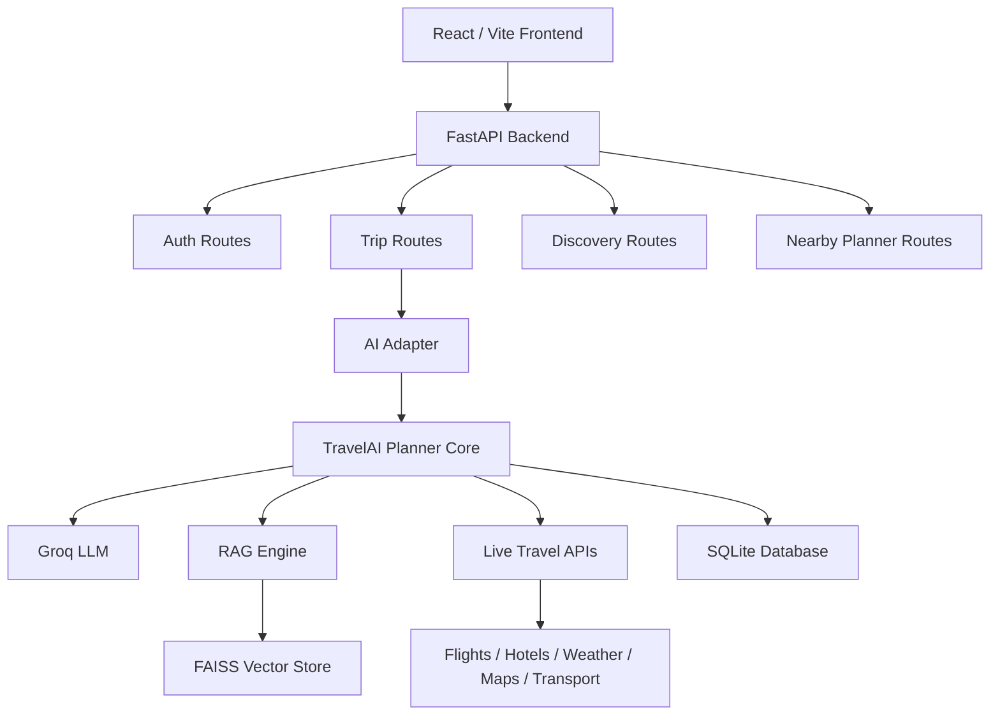

# Architecture Overview

This project is a full-stack travel AI application that helps users plan trips, save itineraries, refine them, and explore nearby travel ideas. The experience is split into three layers:

1. A React frontend for the user interface
2. A FastAPI backend for auth, trip data, and API routing
3. An AI planning core that generates and refines itinerary content using LLMs, RAG, and live travel APIs

---

## 1. What the app does

The app lets a user:

- sign up or log in
- create a trip plan for an origin and destination
- get an AI-generated itinerary with days, stops, food, stays, and cost ideas
- refine the itinerary with natural-language instructions
- view saved trips and previous versions
- explore travel trends and nearby planner ideas
- use a travel command center for budget and trip refinement workflows

---

## 2. High-level architecture

---

## 3. Main pieces of the system

### Frontend

Location: frontend/

The frontend is a React + Vite app. It contains pages such as:

- Home: trip planning entry point
- PlanTrip: trip form and planning flow
- Dashboard: saved trips
- TripDetails: detailed trip view
- TravelCommand: refinement and progress center
- IndiaPulse: travel trends and events
- NearbyPlanner: short-trip and instant escape ideas
- Login / Signup / Profile

The app uses React Router and sends requests to the backend API.

### Backend

Location: backend/

The backend is a FastAPI service that exposes endpoints for:

- authentication
- trip creation
- trip refinement
- trip version history and rollback
- discovery/trends
- nearby planner suggestions

The main entrypoint is backend/main.py. It wires the app, enables CORS, creates the database tables, and includes all routers.

### AI core

Location: ai_core/

This is the intelligence layer of the product. It contains:

- agent_core.py: the main planning engine
- agent_router.py: orchestration logic for the travel workflow
- rag_engine.py: retrieval logic for relevant travel context
- rag_documents.py: local travel knowledge content
- zapi/: wrappers for live travel-related APIs such as flights, hotels, transport, weather, and maps
- trip_payload.py: helpers for itinerary formatting, budget logic, and fallback planning

This layer is responsible for turning a user’s trip request into a rich, structured itinerary.

---

## 4. How a trip request actually works

When a user creates a trip, the flow is roughly:

1. The frontend sends a trip request to the backend.
2. The backend route receives the request and calls the AI adapter.
3. The AI adapter creates a TravelAI planner instance.
4. The planner gathers context from:
   - the user’s request
   - travel-related RAG data
   - live APIs for flights, hotels, weather, and nearby places
5. The system builds a structured itinerary and returns it.
6. The backend saves the trip into the database.
7. The frontend displays the generated itinerary.

For refinements, the system reuses the existing itinerary and asks the AI core to adjust it based on the user’s instruction.

---

## 5. Key modules and responsibilities

### Authentication

- backend/auth/auth_router.py handles signup and login API routes
- backend/auth/auth_service.py contains the business logic
- backend/auth/auth_models.py and auth_schemas.py define user data and request validation

### Trips

- backend/trips/trip_router.py exposes trip APIs
- backend/trips/trip_service.py handles database operations
- backend/trips/trip_models.py defines the trip and related persistence model

### Discovery and nearby planning

- backend/discovery/trends_router.py provides travel trends data
- backend/nearby/nearby_router.py and nearby_service.py support short-trip planning features

### Database

- backend/database/engine.py and session.py manage SQLAlchemy setup
- SQLite is used for local development
- the app creates tables automatically on startup

---

## 6. AI behavior in plain English

The system does not just generate text from a single prompt. It tries to make planning more useful by combining several sources:

- LLM reasoning for itinerary quality and travel planning
- RAG for travel knowledge and historical context
- live travel APIs for current flight, hotel, weather, and location data
- budget-aware formatting so the output can be more practical for users

The AI core also has fallback behavior, so if a live API fails, it can continue with cached or offline-style estimates.

---

## 7. Data and persistence

The app uses:

- SQLite for local development data storage
- JWT-based authentication for protected routes
- saved trip records with itinerary content
- version history for trip refinements and rollbacks

This means the app can remember user trips and preserve earlier versions instead of only producing one-off responses.

---

## 8. External integrations

The app can use external services such as:

- Groq for LLM generation
- SerpAPI / Serper for web context and travel search enrichment
- OpenWeather for weather context
- Google-style place and map data for attractions, restaurants, and nearby planning

These integrations make the planner more useful than a static prompt-only assistant.

---

## 9. Why the project is structured this way

The architecture separates concerns clearly:

- frontend handles presentation and interaction
- backend handles requests, auth, persistence, and API orchestration
- AI core handles reasoning, retrieval, and travel enrichment

That separation keeps the product easier to extend. For example, new features can be added to the frontend, new API routes can be added to the backend, and new planning logic can be introduced in the AI layer without rewriting the whole app.

---

## 10. In one sentence

This repository is a travel-planning platform where a React app talks to a FastAPI backend, which uses an AI orchestration layer powered by LLMs, RAG, and live travel APIs to generate, refine, and save personalized trip itineraries.
